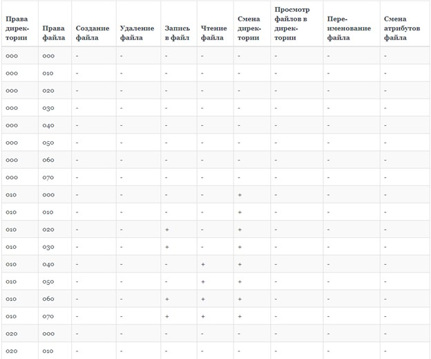
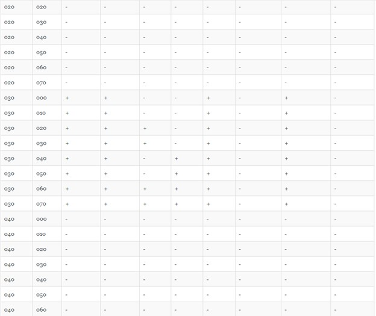

---
## Front matter
title: "Лабораторная работа №4."
subtitle: "Дискреционное разграничение прав Linux. Два Пользователя"
author: "Никита Дмитриевич Белов"

## Generic otions
lang: ru-RU
toc-title: "Содержание"

## Bibliography
bibliography: bib/cite.bib
csl: pandoc/csl/gost-r-7-0-5-2008-numeric.csl

## Pdf output format
toc: true # Table of contents
toc-depth: 2
lof: true # List of figures
lot: true # List of tables
fontsize: 12pt
linestretch: 1.5
papersize: a4
documentclass: scrreprt
## I18n polyglossia
polyglossia-lang:
  name: russian
  options:
	- spelling=modern
	- babelshorthands=true
polyglossia-otherlangs:
  name: english
## I18n babel
babel-lang: russian
babel-otherlangs: english
## Fonts
mainfont: PT Serif
romanfont: PT Serif
sansfont: PT Sans
monofont: PT Mono
mainfontoptions: Ligatures=TeX
romanfontoptions: Ligatures=TeX
sansfontoptions: Ligatures=TeX,Scale=MatchLowercase
monofontoptions: Scale=MatchLowercase,Scale=0.9
## Biblatex
biblatex: true
biblio-style: "gost-numeric"
biblatexoptions:
  - parentracker=true
  - backend=biber
  - hyperref=auto
  - language=auto
  - autolang=other*
  - citestyle=gost-numeric
## Pandoc-crossref LaTeX customization
figureTitle: "Рис."
tableTitle: "Таблица"
listingTitle: "Листинг"
lofTitle: "Список иллюстраций"
lotTitle: "Список таблиц"
lolTitle: "Листинги"
## Misc options
indent: true
header-includes:
  - \usepackage{indentfirst}
  - \usepackage{float} # keep figures where there are in the text
  - \floatplacement{figure}{H} # keep figures where there are in the text
---

# Цель работы

Получение практических навыков работы в консоли с атрибутами файлов для групп пользователей.

# Задание

# Теоретическое введение

Здесь описываются теоретические аспекты, связанные с выполнением работы.

Например, в табл. [-@tbl:std-dir] приведено краткое описание стандартных каталогов Unix.

: Описание некоторых каталогов файловой системы GNU Linux {#tbl:std-dir}

| Имя каталога | Описание каталога                                                                                                          |
|--------------|----------------------------------------------------------------------------------------------------------------------------|
| `/`          | Корневая директория, содержащая всю файловую                                                                               |
| `/bin `      | Основные системные утилиты, необходимые как в однопользовательском режиме, так и при обычной работе всем пользователям     |
| `/etc`       | Общесистемные конфигурационные файлы и файлы конфигурации установленных программ                                           |
| `/home`      | Содержит домашние директории пользователей, которые, в свою очередь, содержат персональные настройки и данные пользователя |
| `/media`     | Точки монтирования для сменных носителей                                                                                   |
| `/root`      | Домашняя директория пользователя  `root`                                                                                   |
| `/tmp`       | Временные файлы                                                                                                            |
| `/usr`       | Вторичная иерархия для данных пользователя                                                                                 |

Более подробно об Unix см. в [@gnu-doc:bash;@newham:2005:bash;@zarrelli:2017:bash;@robbins:2013:bash;@tannenbaum:arch-pc:ru;@tannenbaum:modern-os:ru].

# Выполнение лабораторной работы

## Создание учетных записей

Создаём новые учётные записи guest и guest2, используя учетную запись администратора и команду useradd.

После этого зададим пароль с помощью команды passwd, используя учетную запись администратора.

{ #fig:001 width=70% }

## Вход в систему от двух пользователей

Добавляем пользователя guest2 в группу guest командой gpasswd -a guest2 guest.

Входим в систему в одной консоли от имени пользователя guest, определяем директорию, в которой находимся, с помощью команды pwd.

Аналогичные действия выполняем во второй консоли для пользователя guest2.

{ #fig:002 width=70% }

{ #fig:003 width=70% }

## Принадлежность к группам

Для обоих пользователей уточняем имя пользователя, группу, кто в неё входит и к каким группам принадлежат пользователи.

С помощью команд groups guest и groups guest2 определяем в какие группы входят пользователи guest и guest2. Результат индентичен выводу команд id -Gn и id -G.

{ #fig:004 width=70% }

{ #fig:005 width=70% }

Также эту же информацию можно было получить, воспользовавшись командой cat /etc/group.

С помощью команды newgrp guest регистрируем пользователя guest2 в группе guest.

## Права и атрибуты

От имени пользователя guest изменяем права директории /home/guest, разрешив все действия для пользователей группы при помощи команды chmod g+rwx /home/guest.

От имени пользователя guest снимаем с директории /home/guest/dir1 все атрибуты командой chmod 000 dirl.

{ #fig:006 width=70% }

{ #fig:007 width=70% }

## Таблица 3.1

Меняя атрибуты у директории dir1 и файла file1 от имени пользователя guest и делая проверку от пользователя guest2, заполняем таблицу:

{ #fig:008 width=70% }

{ #fig:009 width=70% }

{ #fig:010 width=70% }

{ #fig:011 width=70% }

## Таблица 3.2

На основании заполненной таблицы определяем те или иные минимально необходимые права для выполнения пользователем guest2 операций внутри директории dir1 и заполняем таблицу 3.2.

{ #fig:012 width=70% }

# Выводы

Получили практические навыки работы в консоли с атрибутами файлов для групп пользователей.

# Список литературы{.unnumbered}

::: {#refs}
:::
