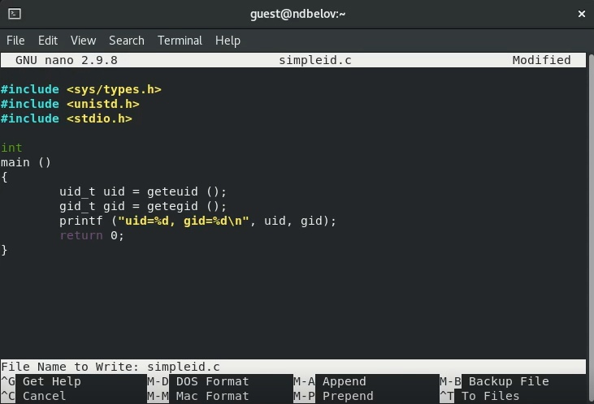
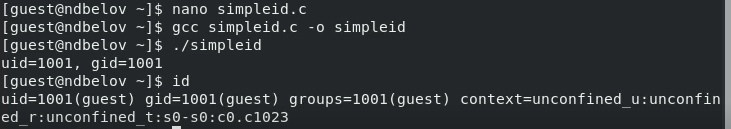
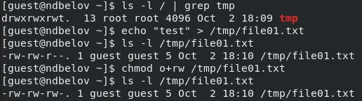
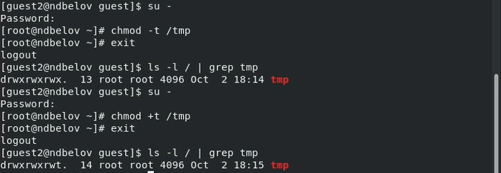

---
## Front matter
lang: ru-RU
title: Лабораторная работа №5
subtitle: Основы информационной безопасности
author:
  - Белов Н.Д.
institute:
  - Российский университет дружбы народов, Москва, Россия
date: 02 октября 2022

## i18n babel
babel-lang: russian
babel-otherlangs: english

## Formatting pdf
toc: false
toc-title: Содержание
slide_level: 2
aspectratio: 169
section-titles: true
theme: metropolis
header-includes:
 - \metroset{progressbar=frametitle,sectionpage=progressbar,numbering=fraction}
 - '\makeatletter'
 - '\beamer@ignorenonframefalse'
 - '\makeatother'
---

# Исследование влияния дополнительных атрибутов

## Цель выполнения лабораторной работы

1. Изучение механизмов изменения идентификаторов, применения SetUID- и Sticky-битов.;

2. Получение практических навыков работы в консоли с дополнительными атрибутами;

3. Рассмотрение работы механизма смены идентификатора процессов пользователей, а также влияние бита Sticky на запись и удаление файлов.

## Выполнение

- Написал программу simpleid от имени пользователя guest

{ #fig:001 width=70% }

## Выполнение

- Выполнил программу `id` и сравнил полученный результат с данными программы

{ #fig:002 width=70% }

## Выполнение

- Усложнил программу, добавив вывод действительных идентификаторов

{ #fig:003 width=50% }

## Выполнение

- Скомпилировал и запустил simpleid2.c `gcc simpleid2.c -o simpleid2`

{ #fig:004 width=70% }

## Выполнение

- Сменил у программы readfile владельца и установил SetU’D-бит

{ #fig:005 width=70% }

## Выполнение

- Проверка выполнения операций от пользователя guest2

{ #fig:006 width=70% }

## Выполнение

- Снял атрибут t с директории /tmp и повторил операции

{ #fig:007 width=70% }

## Выводы

- Изучил механизмы изменения идентификаторов, применения SetUID- и Sticky-битов. Получил практические навыки работы в консоли с дополнительными атрибутами. Рассмотрел работу механизма смены идентификатора процессов пользователей, а также влияние бита Sticky на запись и удаление файлов.

