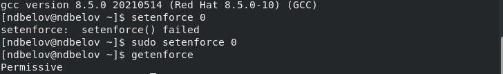
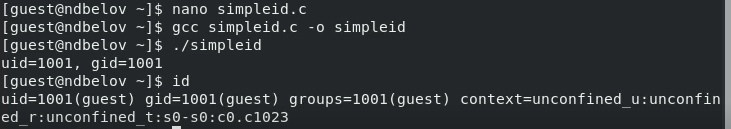
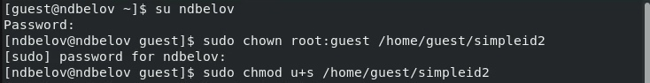
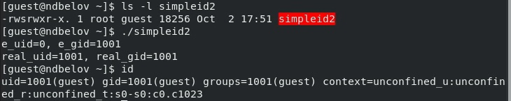
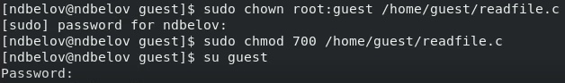
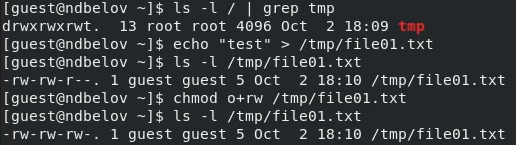
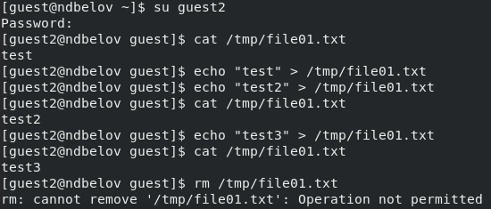
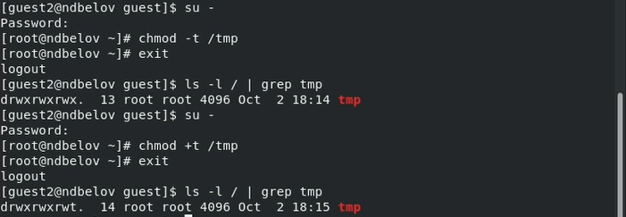

---
## Front matter
title: "Лабораторная работа №5"
subtitle: "Основы информационной безопасности"
author: "Белов Никита Дмитриевич"

## Generic otions
lang: ru-RU
toc-title: "Содержание"

## Bibliography
bibliography: bib/cite.bib
csl: pandoc/csl/gost-r-7-0-5-2008-numeric.csl

## Pdf output format
toc: true # Table of contents
toc-depth: 2
lof: true # List of figures
lot: true # List of tables
fontsize: 12pt
linestretch: 1.5
papersize: a4
documentclass: scrreprt
## I18n polyglossia
polyglossia-lang:
  name: russian
  options:
	- spelling=modern
	- babelshorthands=true
polyglossia-otherlangs:
  name: english
## I18n babel
babel-lang: russian
babel-otherlangs: english
## Fonts
mainfont: PT Serif
romanfont: PT Serif
sansfont: PT Sans
monofont: PT Mono
mainfontoptions: Ligatures=TeX
romanfontoptions: Ligatures=TeX
sansfontoptions: Ligatures=TeX,Scale=MatchLowercase
monofontoptions: Scale=MatchLowercase,Scale=0.9
## Biblatex
biblatex: true
biblio-style: "gost-numeric"
biblatexoptions:
  - parentracker=true
  - backend=biber
  - hyperref=auto
  - language=auto
  - autolang=other*
  - citestyle=gost-numeric
## Pandoc-crossref LaTeX customization
figureTitle: "Рис."
tableTitle: "Таблица"
listingTitle: "Листинг"
lofTitle: "Список иллюстраций"
lotTitle: "Список таблиц"
lolTitle: "Листинги"
## Misc options
indent: true
header-includes:
  - \usepackage{indentfirst}
  - \usepackage{float} # keep figures where there are in the text
  - \floatplacement{figure}{H} # keep figures where there are in the text
---

# Цель работы

Изучение механизмов изменения идентификаторов, применения SetUID- и Sticky-битов. Получение практических навыков работы в консоли с дополнительными атрибутами. Рассмотрение работы механизма смены идентификатора процессов пользователей, а также влияние бита Sticky на запись и удаление файлов.

# Задание

# Выполнение лабораторной работы

Установил gcc с помощью команды `yum install gcc`.

{ #fig:001 width=70% }

Отменил на текущую сессию SELinux командой `setenforce 0`. Вошёл в систему от имени пользователя guest, создал программу `simpleid.c`.

{ #fig:002 width=70% }

Скомпилировал программу и убедился, что файл программы создан: `gcc simpleid.c -o simpleid`. Выполнил программу simpleid: `./simpleid`. Выполнил программу `id` и сравнил полученный результат с данными предыдущего пункта задания. Полученные значения id совпадают.

{ #fig:003 width=70% }

Усложнил программу, добавив вывод действительных идентификаторов, получившуюися программу назвал `simpleid2.c`.

{ #fig:004 width=70% }

Скомпилировал и запустил simpleid2.c `gcc simpleid2.c -o simpleid2`, а затем `./simpleid2`.

{ #fig:005 width=70% }

От имени суперпользователя выполнил команды: `chown root:guest /home/guest/simpleid2`, а затем `chmod u+s /home/guest/simpleid2`. Первая команда изменяет права на файл с guest на root. А затем устанавливает атрибут SetUID, который запускает программу не с правами пользователя, а с правами владельца файла. Затем выполнил  проверку изменений с помощью команды `ls -l simpleid2`. (рис. -@fig:006)

{ #fig:006 width=70% }

Запустил simpleid2 и id: `./simpleid2`, `id`. При данном запуску выводы совпадают.

{ #fig:007 width=70% }

Проделал то же самое с атрибутом SetGID (установление прав для владеющей группы). Запустил файл. Теперь выводы для группы различны.

Создал программу `readfile.c`.

{ #fig:008 width=70% }

Откомпилировал программу: `gcc readfile.c -o readfile`. Сменил владельца у файла readfile.c и изменил права так, чтобы только суперпользователь(root) мог прочитать его, a guest не мог. Проверил, что пользователь guest не может прочитать файл readfile.с

{ #fig:009 width=70% }

{ #fig:010 width=70% }

Сменил у программы readfile владельца и установил SetU’D-бит. Программа readfile может прочитать файл readfile.c. Программа readfile может прочитать файл /etc/shadow. 

## Исследование Sticky-бита.

Узнал, установлен ли атрибут Sticky на директории /tmp, для чего выполнил команду `ls -l / | grep tmp`

{ #fig:011 width=70% }
От имени пользователя guest создал файл file01.txt в директории /tmp
со словом test `echo "test" > /tmp/file01.txt`. Просмотрел атрибуты у только что созданного файла и разрешил чтение и запись для категории пользователей «все остальные»: `ls -l /tmp/file01.txt`, `chmod o+rw /tmp/file01.txt`, `ls -l /tmp/file01.txt`. От пользователя guest2 (не являющегося владельцем) попробовал прочитать файл /tmp/file01.txt: `cat /tmp/file01.txt`, записать в файл `/tmp/file01.txt` текст test3, стерев при этом всю имеющуюся в файле информацию командой `echo "test3" > /tmp/file01.txt`. Проверил содержимое файла командой `cat /tmp/file01.txt`, попробовал дозаписать в файл `/tmp/file01.txt` слово test2 командой `echo "test2" >> /tmp/file01.txt`, удалить файл /tmp/file01.txt командой `rm /tmp/file01.txt` Файл удалить не удалось.

{ #fig:012 width=70% }

Повысил свои права до суперпользователя следующей командой `su -`
и выполнил после этого команду, снимающую атрибут t (Sticky-бит) с
директории /tmp: `chmod -t /tmp`. Затем попробовал выполнить все вышеперечисленные операции. Все удалось.

Повысил свои права до суперпользователя и вернул атрибут `t` на директорию /tmp: `su -`, `chmod +t /tmp`, `exit`.

{ #fig:013 width=70% }

# Выводы

Изучил механизмы изменения идентификаторов, применения SetUID- и Sticky-битов. Получил практические навыки работы в консоли с дополнительными атрибутами. Рассмотрел работу механизма смены идентификатора процессов пользователей, а также влияние бита Sticky на запись и удаление файлов.
